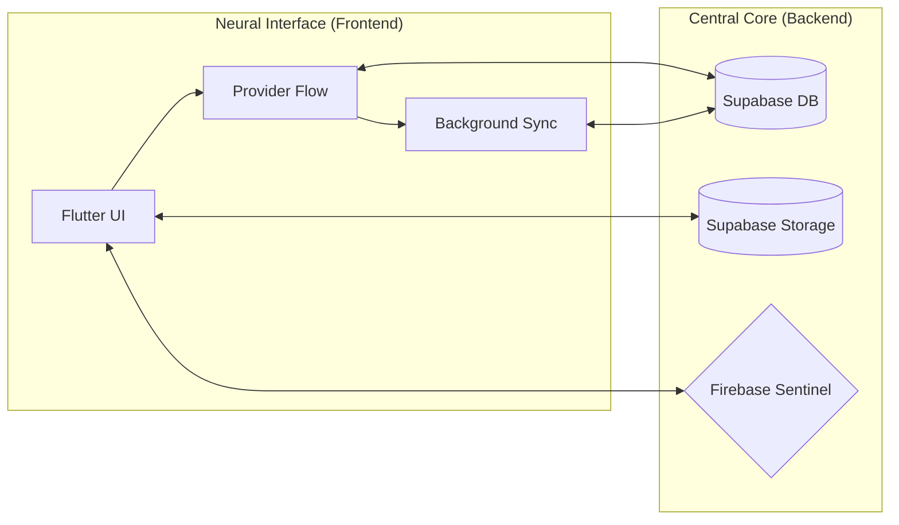

# 
🛸 **Cargoza Neural Systems** 🛸

  

  
  
  

  
  
  

---

## 🌐 Navigation Grid
- [🇬🇧 English Neural Deck](#-english-neural-deck)
- [🇫🇷 Pont de Commande Français](#-pont-de-commande-français)
- [🇪🇸 Cubierta Neuronal Española](#-cubierta-neuronal-española)
- [🇵🇹 Convés Neural Português](#-convés-neural-português)

---

## 🇬🇧 English Neural Deck

### 🌌 **Autonomous Logistics Ecosystem**
Cargoza isn't just an app; it's a multi-dimensional logistics infrastructure. Built for the era of hyper-connectivity, it synchronizes human movement and cargo flow through a decentralized-first approach.

#### ⚡ **Cyber-Core Modules**
- 🛰️ **Quantum Positioning**: Asynchronous background GPS polling with battery-optimized heuristics.
- 🧬 **Holographic Roles**: 
  - **Overlord (Admin)**: Complete grid control and user orchestration.
  - **Voyager (Transporter)**: Optimized mission routing and real-time availability.
  - **Oracle (Supervisor)**: Sector analysis and operational safety.
  - **Nomad (Client)**: Instant logistics acquisition and tracking.
- 📦 **Nebula Marketplace**: A peer-to-peer transport exchange with live negotiation protocols.
- 🔐 **Sentinel Shield**: Double-layer security (Firebase identity + Supabase RLS data encryption).
- 🌗 **Deep-Space UI**: Kinetic typography, shimmers, and micro-interactions powered by Lottie.

#### 🛠️ **Technological Synthesis**
- **Core Processor**: Flutter 3.24+ (Dart 3.4)
- **Synaptic Storage**: Supabase (Postgres Realtime + Storage Buckets)
- **Encryption Link**: Firebase Auth (Google & Email protocols)
- **Navigation Sensors**: OSM + Flutter Map Grid
- **State Flux**: Provider 6.1

---

## 🇫🇷 Pont de Commande Français

### 🌌 **Écosystème Logistique Autonome**
Cargoza n'est pas qu'une simple application ; c'est une infrastructure logistique multidimensionnelle. Conçue pour l'ère de l'hyper-connectivité, elle synchronise les mouvements humains et le flux de marchandises via une approche décentralisée.

#### ⚡ **Modules Cyber-Noyau**
- 🛰️ **Positionnement Quantique** : Analyse GPS asynchrone en arrière-plan avec heuristiques d'optimisation de batterie.
- 🧬 **Rôles Holographiques** :
  - **Overlord (Admin)** : Contrôle total de la grille et orchestration des utilisateurs.
  - **Voyager (Transporteur)** : Routage de mission optimisé et disponibilité en temps réel.
  - **Oracle (Superviseur)** : Analyse de secteur et sécurité opérationnelle.
  - **Nomad (Client)** : Acquisition logistique instantanée et suivi.
- 📦 **Marché Nebula** : Échange de transport de pair à pair avec protocoles de négociation en direct.
- 🔐 **Bouclier Sentinel** : Sécurité double couche (identité Firebase + chiffrement de données Supabase RLS).
- 🌗 **UI Espace Profond** : Typographie cinétique, effets shimmer et micro-interactions via Lottie.

#### 🛠️ **Synthèse Technologique**
- **Processeur Central** : Flutter 3.24+ (Dart 3.4)
- **Stockage Synaptique** : Supabase (Postgres Realtime + Storage Buckets)
- **Lien de Chiffrement** : Firebase Auth (Protocoles Google & Email)
- **Capteurs de Navigation** : Grille OSM + Flutter Map
- **Flux d'État** : Provider 6.1

---

## 🇪🇸 Cubierta Neuronal Española

### 🌌 **Ecosistema Logístico Autónomo**
Cargoza no es solo una aplicación; es una infraestructura logística multidimensional. Construida para la era de la hiperconectividad, sincroniza el movimiento humano y el flujo de carga a través de un enfoque descentralizado.

#### ⚡ **Módulos del Ciber-Núcleo**
- 🛰️ **Posicionamiento Cuántico**: Sondeo GPS asíncrono en segundo plano con heurísticas de optimización de batería.
- 🧬 **Roles Holográficos**:
  - **Overlord (Admin)**: Control total de la red y orquestación de usuarios.
  - **Voyager (Transportista)**: Enrutamiento de misiones optimizado y disponibilidad en tiempo real.
  - **Oracle (Supervisor)**: Análisis de sector y seguridad operativa.
  - **Nomad (Cliente)**: Adquisición logística instantánea y seguimiento.
- 📦 **Mercado Nebula**: Un intercambio de transporte entre pares con protocolos de negociación en vivo.
- 🔐 **Escudo Centinela**: Seguridad de doble capa (identidad Firebase + cifrado de datos Supabase RLS).
- 🌗 **UI Espacio Profundo**: Tipografía cinética, brillos y microinteracciones impulsadas por Lottie.

#### 🛠️ **Síntesis Tecnológica**
- **Procesador Central**: Flutter 3.24+ (Dart 3.4)
- **Almacenamiento Sináptico**: Supabase (Postgres Realtime + Storage Buckets)
- **Enlace de Cifrado**: Firebase Auth (Protocolos Google y Email)
- **Sensores de Navegación**: Red OSM + Flutter Map
- **Flujo de Estado**: Provider 6.1

---

## 🇵🇹 Convés Neural Português

### 🌌 **Ecossistema Logístico Autónomo**
Cargoza não é apenas uma aplicação; é uma infraestrutura logística multidimensional. Criado para a era da hiper-conectividade, sincroniza o movimento humano e o fluxo de carga através de uma abordagem descentralizada.

#### ⚡ **Módulos Cyber-Core**
- 🛰️ **Posicionamento Quântico**: Polling GPS assíncrono em segundo plano com heurísticas de otimização de bateria.
- 🧬 **Papéis Holográficos**:
  - **Overlord (Admin)**: Controlo total da grelha e orquestração de utilizadores.
  - **Voyager (Transportador)**: Encaminhamento de missões otimizado e disponibilidade em tempo real.
  - **Oracle (Supervisor)**: Análise de setor e segurança operacional.
  - **Nomad (Cliente)**: Aquisição logística instantânea e rastreamento.
- 📦 **Nebula Marketplace**: Uma bolsa de transporte peer-to-peer com protocolos de negociação ao vivo.
- 🔐 **Escudo Sentinela**: Segurança de camada dupla (identidade Firebase + criptografia de dados Supabase RLS).
- 🌗 **UI Espaço Profundo**: Tipografia cinética, shimmers e micro-interações alimentadas por Lottie.

#### 🛠️ **Síntese Tecnológica**
- **Processador Central**: Flutter 3.24+ (Dart 3.4)
- **Armazenamento Sináptico**: Supabase (Postgres Realtime + Storage Buckets)
- **Ligação de Criptografia**: Firebase Auth (Protocolos Google & Email)
- **Sensores de Navegação**: Grelha OSM + Flutter Map
- **Fluxo de Estado**: Provider 6.1

---

## 🛠️ System Architecture

---

  <b>Initiated by Ramzi (Connacri) - Neural Architect</b> 
  © 2026 Cargoza Neural Systems. Licensed under MIT Protocol.

