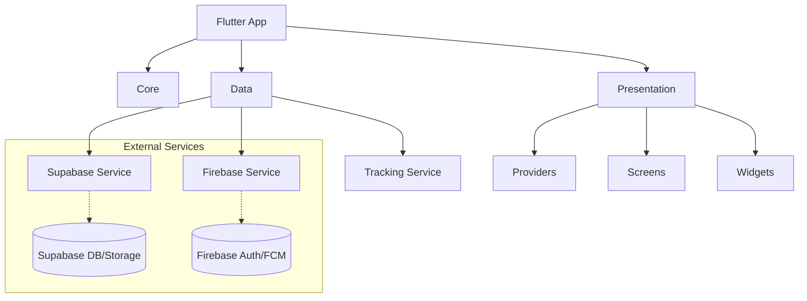

# 🚛 TransportHub

[](https://flutter.dev)
[](https://supabase.com)
[](https://firebase.google.com)
[](https://opensource.org/licenses/MIT)

**TransportHub** is a comprehensive logistics and transportation management platform. It features real-time tracking, multi-role authentication (Admin, Transporter, Supervisor, Client), and a built-in marketplace.

---

## ✨ Features

- 📍 **Real-time Tracking**: Live GPS tracking for transporters with background service support.
- 🔐 **Multi-role Auth**: Secure authentication via Firebase Auth and Supabase RLS.
- 🏪 **Marketplace**: Buy and sell transport listings.
- 📱 **Cross-Platform**: Optimized for Android and Windows Desktop.
- 🔔 **Notifications**: Real-time push notifications via FCM and local logs.
- 🎨 **Material 3 Design**: Modern, clean, and responsive UI with Light/Dark mode.

---

## 🏗️ Architecture



### Project Structure
- `lib/core/`: Configuration, theme, and constants.
- `lib/data/`: Models and infrastructure services.
- `lib/presentation/`: State management (Providers), UI screens, and reusable widgets.
- `supabase_schema.sql`: Full database schema including RLS policies.

---

## 🚀 Getting Started

### 1. Prerequisites
- **Flutter**: `>= 3.24.0`
- **Dart**: `>= 3.4.0`

### 2. Installation
```bash
git clone <your-repo-url>
cd transport_hub
flutter pub get
```

### 3. Firebase Setup
```bash
flutterfire configure --platforms=android,windows
```
*Enable Email/Password and Google Sign-In in the Firebase Console.*

### 4. Supabase Setup
1. Create a project at [supabase.com](https://supabase.com).
2. Run `supabase_schema.sql` in the **SQL Editor**.
3. Create public buckets: `avatars`, `vehicles`, `documents`, `listings`.
4. Enable Realtime for `trackings`, `transport_requests`, and `notifications_log`.
5. Update constants in `lib/core/constants/app_constants.dart`.

---

## 🎨 Design Tokens

| Token | Value | Preview |
|-------|-------|---------|
| **Primary** | `#FF6B35` | 🟠 |
| **Secondary** | `#1A1A2E` | 🔵 |
| **Success** | `#4CAF50` | 🟢 |
| **Warning** | `#FFC107` | 🟡 |
| **Error** | `#E53935` | 🔴 |
| **Gold** | `#FFD700` | 🟡 |

---

## 🛠️ Tech Stack

- **Framework**: [Flutter](https://flutter.dev)
- **Database/Realtime**: [Supabase](https://supabase.com)
- **Authentication/Push**: [Firebase](https://firebase.google.com)
- **Maps**: [OSM + Flutter Map](https://pub.dev/packages/flutter_map)
- **State Management**: [Provider](https://pub.dev/packages/provider)
- **Routing**: [GoRouter](https://pub.dev/packages/go_router)

---

## 📄 License
This project is licensed under the MIT License - see the [LICENSE](LICENSE) file for details.
